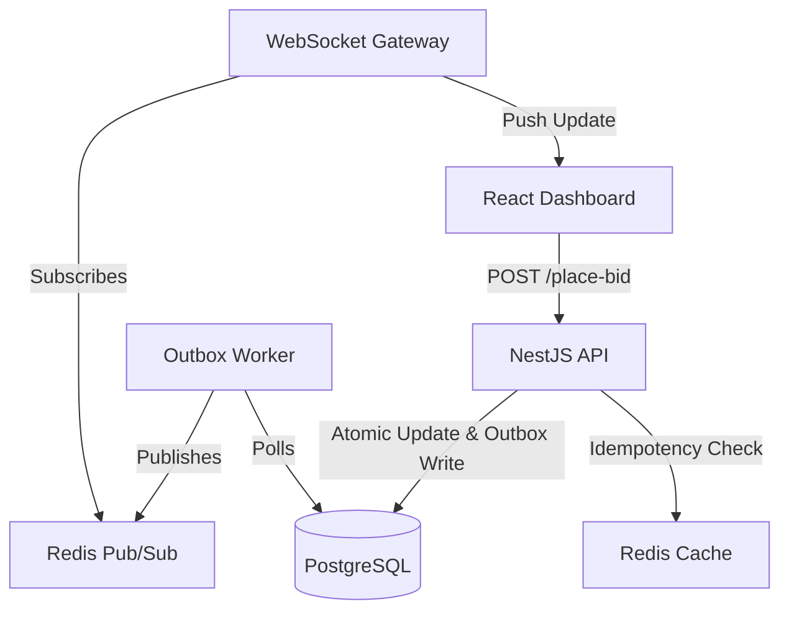

# High-Frequency Auction Platform

A production-grade, high-frequency auction engine built with **NestJS**, **React**, **Redis**, and **PostgreSQL**. This platform is designed to handle intense bidding wars with millisecond latency, guaranteed event delivery, and horizontal scalability.

## 🏗 Architecture Overview

The system follows a **Transactional Outbox Pattern** to ensure that every winning bid is reliably broadcasted to all connected clients, even under heavy load or partial system failure.



### Key Components

1.  **Atomic Bidding Engine:** Uses `UPDATE ... WHERE current_price < new_price` to handle concurrency at the database level without expensive row locks.
2.  **Transactional Outbox:** Ensures that price updates and event notifications are atomic. If the DB write succeeds, the event is guaranteed to eventually reach the client.
3.  **Redis-Backed Idempotency:** Prevents duplicate bid placements from network retries using a 24-hour sliding window.
4.  **Performance Buffered UI:** The React frontend uses a `useRef` buffering strategy to handle high-frequency WebSocket streams (100ms flush loop), preventing browser freeze during bidding wars.

---

## 🚀 Quick Start (Runbook)

### 1. Infrastructure
Spin up the state layer (PostgreSQL & Redis) using Docker:
```bash
docker compose up -d
```

### 2. Installation
Install all dependencies for the monorepo:
```bash
npm install
```

### 3. Start the API
```bash
npm run start:dev -w api
```
*The API is available at `http://localhost:3000/api`*

### 4. Start the Dashboard
```bash
npm run dev -w ui
```
*The UI is available at `http://localhost:5173`*

---

## 🧪 Testing Suite

### Unit & Integration Tests
Validates core bidding logic, atomicity, and idempotency.
```bash
npm test -w api
```

### k6 Load Testing
Simulates 100+ concurrent bidders to prove system stability.
```bash
# Requires k6 installed locally
k6 run load-tests/bidding-burst.js
```

---

## 🏛 Consistency & Decisions

*   **Why WebSockets + Redis?** To allow horizontal scaling. Any API instance can handle a bid, and Redis broadcasts it to all other instances for real-time delivery.
*   **Why Outbox Worker?** To decouple the "Win" transaction from the "Notification" delivery. This prevents the REST API from slowing down due to WebSocket performance.
*   **Why React `useRef` Buffering?** Standard React `useState` triggers a full re-render per packet. At 100ms updates, `useRef` keeps the UI responsive while still feeling "live".

---

## 🛡 Security & Reliability
- **CORS Restricted:** Configured for specific origins in production.
- **Atomic Operations:** Zero chance of "ghost bids" or price overruns.
- **CI/CD:** Automated GitHub Actions pipeline validates every PR with k6 performance gates.

---
Built for the High-Frequency Auction Challenge.
