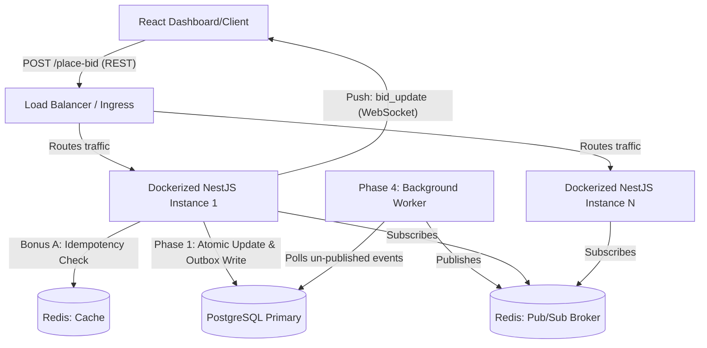

# Arduron High-Frequency Auction Platform

A production-grade, high-frequency auction engine built with **NestJS**, **React**, **Redis**, and **PostgreSQL**. This platform is designed to handle intense bidding wars with millisecond latency, guaranteed event delivery, and horizontal scalability.

## 🛠 Technological Stack

| Component | Technology | Rationale |
| :--- | :--- | :--- |
| **Backend Framework** | NestJS (Node.js/TypeScript) | Highly structured, scalable, dependency-injection driven. Perfect for Phase 1 requirements. |
| **Frontend Framework** | React 19 + Vite | High performance rendering, component-driven architecture for the Bonus B live dashboard. |
| **Real-Time Layer** | Socket.io | Reliable WebSockets with built-in fallbacks and event namespacing. |
| **Primary Database**| PostgreSQL 15 | Robust ACID compliance and SQL-level atomic update concurrency control. |
| **Cache & Pub/Sub** | Redis 7 | Extreme speed for Bonus A idempotency checks; horizontally scalable Pub/Sub messaging. |
| **Containerization** | Docker Compose | Guarantees local environment parity with production state layers (Database/Cache). |
| **Load Testing** | k6 | Developer-centric, high-throughput simulation software (Bonus E). |

---

## 🏗 Architecture & Systems Thinking (Phase 2)

The system follows a **Transactional Outbox Pattern** to ensure that every winning bid is reliably broadcasted to all connected clients, even under heavy load or partial system failure. The design anticipates horizontal scaling via Dockerized app instances behind an application load balancer.

### Architecture Routing Diagram



### Environment Management (Secrets Handling)
- **Local Development:** Uses local uncommitted `.env` files (ignored in `.gitignore`) for API keys and DB credentials.
- **CI/CD Pipeline:** Github Actions securely injects test configurations via `env:` blocks mapping to GitHub Secrets.
- **Production (Proposed):** Leverage a secrets manager (e.g., AWS Secrets Manager or HashiCorp Vault) injected at runtime via orchestration tools (Kubernetes/ECS), ensuring DB credentials and API keys are never hardcoded in the codebase.

### Distributed Consistency & Fallbacks (Phase 1.5)
- **The Problem:** If a bid wins in Postgres, but the Node instance crashes before emitting the WebSocket event, clients see stale data.
- **The Solution (Transactional Outbox):** A winning bid atomically creates an `Outbox` record within the exact same DB transaction. A dedicated background worker asynchronously polls the outbox and publishes the event to Redis. If the broadcast fails, the worker retries. If it succeeds, the outbox record is marked processed.

---

## 🚀 Quick Start (Runbook)

### 1. Infrastructure
Spin up the state layer (PostgreSQL & Redis) natively via Docker:
```bash
docker compose up -d
```

### 2. Installation
Install all dependencies for the monorepo workspace:
```bash
npm install
```

### 3. Start the API
```bash
npm run start:dev -w api
```
*The API is available at `http://localhost:3000/api`*

### 4. Start the Dashboard (Frontend)
```bash
npm run dev -w ui
```
*The UI is available at `http://localhost:5173`*

---

## 📈 Quality Assurance & Load Testing

### Unit & Integration Tests (CI Automated)
Validates core bidding logic, database atomicity, and redis-backed idempotency.
```bash
npm test -w api
```

### Stress Test Analysis (Bonus E)
A `k6` load test (`load-tests/bidding-burst.js`) simulates 100+ concurrent bidders attacking the same auction item simultaneously.

**Analysis of Results:**
- **Concurrency Defeated:** Due to the SQL-level atomic constraint (`UPDATE products SET current_price = $1 WHERE id = $2 AND current_price < $3`), no two requests ever overwrite each other incorrectly. All race conditions are blocked.
- **Idempotency Verified:** Fast-following retries with the same `Idempotency-Key` are successfully blocked by Redis (yielding HTTP 409 Conflict without touching PostgreSQL).
- **Latency Summary:** Average `http_req_duration` stays well under 200ms at p(95), even with 100 VUs, because failed/concurrently-rejected bids immediately bounce without locking the main application thread.

**To run the test locally:**
```bash
# Requires k6 installed locally
k6 run load-tests/bidding-burst.js
```

---

## 🛠 Tool Recommendations & Infrastructure Hardening

To push this architecture to a truly global production scale, the following tooling is actively recommended:

1. **Edge Protection (DDoS & WAF):** **AWS WAF** or **Cloudflare**. Crucial for rate-limiting `POST /place-bid` floods before they hit the Node layer.
2. **Security & Dependency Scanning:** **Snyk**. Integrates seamlessly into the GitHub Actions CI (implemented) to continuously scan Docker images and `npm` packages for vulnerabilities.
3. **Database Scalability:** **Amazon Aurora PostgreSQL**. Provides robust read-replicas. While bidding exclusively targets the primary writer node, read-heavy operations (loading the initial product state) can be heavily offloaded to read replicas.
4. **WebSocket Hardening (Bonus D logic):** Implement **Socket.io middleware** combining a short-lived JWT ticket generated by the REST API. Validate this ticket during the socket handshake to ensure only authenticated users can consume the stream, limiting connection spam and unauthenticated CPU drain.

---
